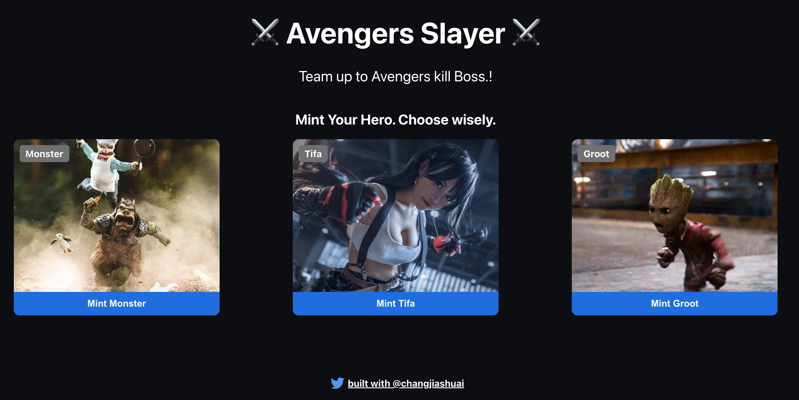
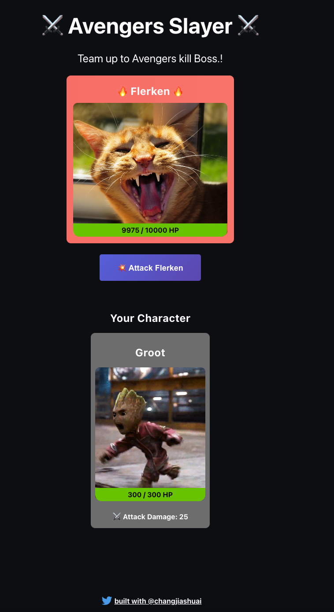

## Epic Game NFT Project

The goal of our game will be to destroy a boss. Let's say that boss has 10,000 HP. What players do is when they start the game, they mint a character NFT that has a certain amount of Attack Damage and HP. Players can order their character NFT to attack the boss and deal damage to it. Kinda like a Pokemon!

The goal? Players need to work together to attack the boss and bring its HP down to 0. The catch? Every time a player hit the boss, the boss hits the player back! If the NFT's HP goes below 0, the player's NFT dies and they can't hit the boss anymore. Players can only have one character NFT in their wallet. Once the character's NFT dies, it's game over. That means many players need to join forces to attack the boss and kill it.
Try running some of the following tasks:

### Project url
```
https://nft-game-project.jiashuaichang.repl.co/
```

### Screenshot





